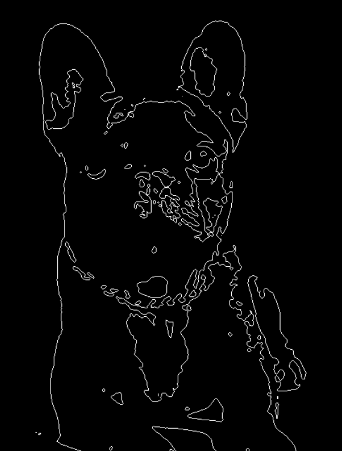
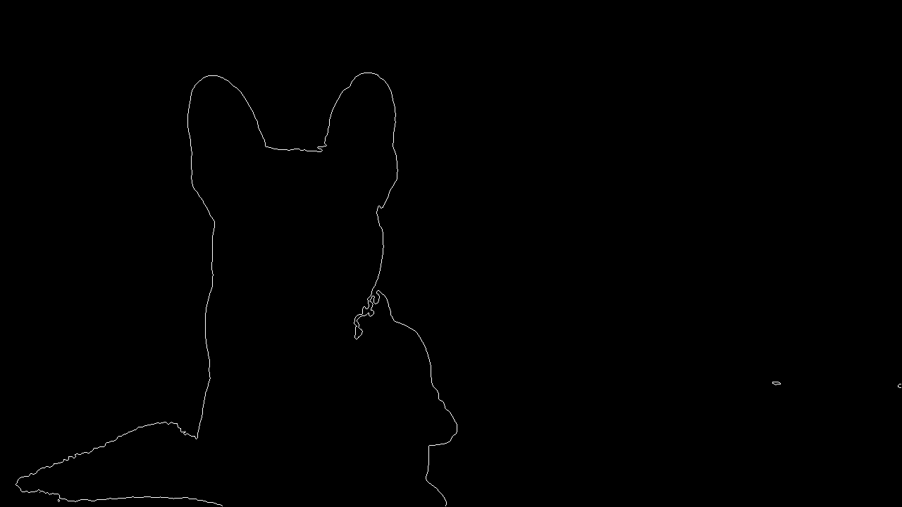
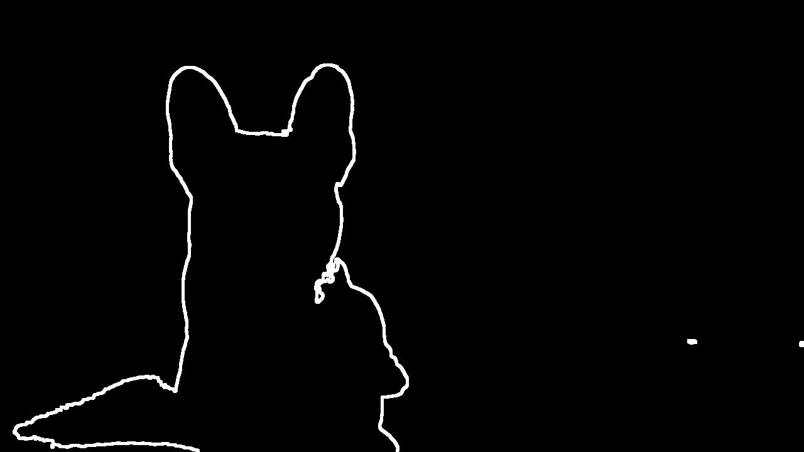
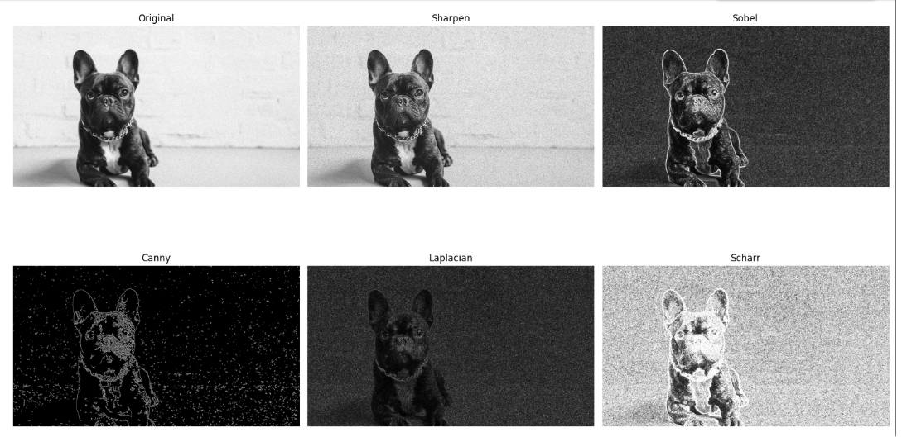
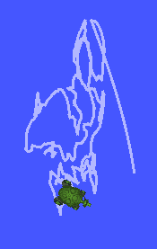
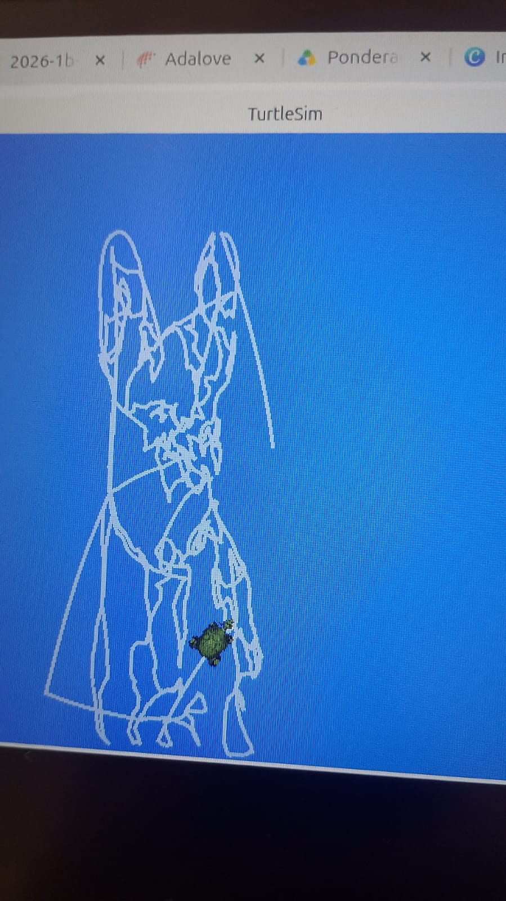
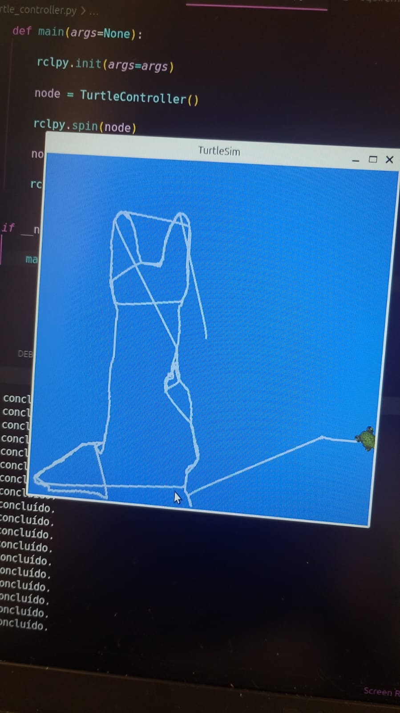
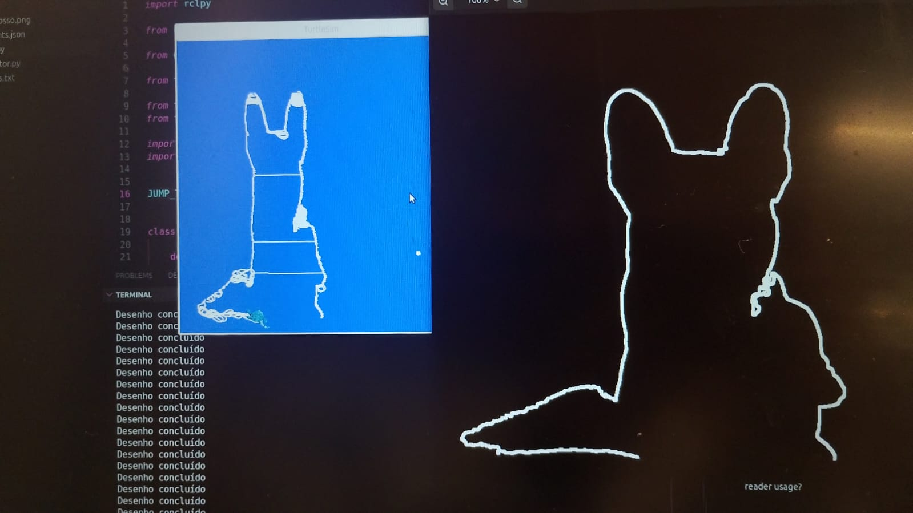
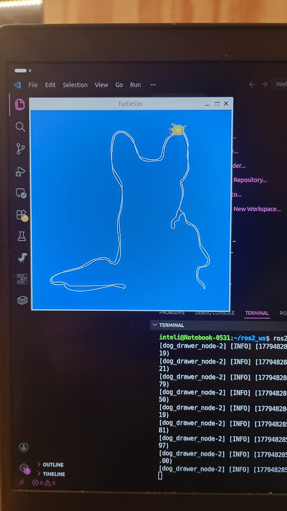

# Documentação Geral da Atividade Ponderada

&nbsp; &nbsp; &nbsp; &nbsp;Ao analisar a atividade, inferiu-se que a problemática trata-se, no que tange à visão computacional, de isolar um objeto escuro de um fundo claro, extraindo a sua silhueta. Já no que tange à ROS2, a atividade demanda que a tartaruga do turtlesim percorra a borda do objeto extraído. Nesse sentido, todo o desenvolvimento foi feito sem utilizar bibliotecas e códigos prontos, mas codando a lógica e a matemática das técnicas de tratamento e manipulação de imagem de forma bruta. Para isso, foi necessário revisitar materiais de estudos passados e realizar estudos aprofundados de forma adicional.

## Visão Computacional 

&nbsp; &nbsp; &nbsp; &nbsp;No que tange à visão computacional, foi mapeado estratégias de tratamento de imagem para extrair a silhueta com melhor performance, da seguinte forma:

### **1. Conversão para Escala de Cinza**  
**Justificativa:** cada pixel na coordenada (x,y) é um vetor tridimensional P(x,y)=[B, G, R], no qual cada componente varia entre 0 e 255\. Nessa esfera, a conversão para a escala de cinza tem a importância de sair do tratamento com vetores de 3 dinensões para uma problemática com 2 dimensões, haja vista que a escala de cinza trabalha com valores de intensidade.

### **2. Convolução**   
**Justificativa:** a convolução foi aplicada com o objetivo de suavizar ruídos da imagem, haja vista que imagens digitais sofrem de ruídos de alta frequência (pequenas variações bruscas de pixel para pixel).

**Aprofundamentamento Matemático:** vale destacar que a convolução na visão compoutacional trata-se da convolução espacial discreta, a qual configura-se como a operação matemática de multiplicar pixel a pixel de duas imagens (ou seja, 2 matrizes). Isso pode ser usado com vários fitos, como encontrar objetos em uma imagem, sobrepondo uma imagem filtro em cima e deslocando-a sobre a imagem de análise até encontrar valores altos para o que está procurando. No contexto da atividade, foi usado para fazer efeito de suavisar a imagem com a aplicação de Filtro Gausiano. 

### **3. Binarização:**  
**Justificativa:** Em razão do objetivo estar centrado em separar um objeto escuro de um fundo claro, a binarização foi pensada para separar, de forma drástica, em duas categorias: o que tem grande chance de ser o fundo claro (255) e o que tem grande chance de ser o objeto/cachorro (0).

### **4. Flood Fill**  
**Justificativa:** Haja vista detalhes mais claros no interior do cachorro, a binarização supracitada marcou esses detalhes como 255 (branco). No entanto, esses detalhes estão isolados dentro do corpo do cachorro (não tocam as bordas da imagem). O Flood Fill, partindo do canto $(0,0)$, "escorre" apenas pelo fundo exterior contínuo. Dessa forma, tudo que ele conseguir visitar pertence ao cenário externo verdadeiro e o que ele não conseguir visitar (mesmo sendo branco) está dentro do objeto. Assim, isso serve para garantir que pegue, de fato, apenas o CONTORNO do cachorro, e não os detalhes interiores, como olhos e nariz.

  

Figura 1 - Imagem com detalhes interiores - Sem binarização e sem Flood Fill  

  
 Fonte autoral (2026).
 

  

 
Figura 2 - Imagem apenas do Contorno (conforme a demanda) - Com binarização e com Flood Fill  

  
 Fonte autoral (2026).
 

  

### **5. Extração e Potencialização do Contorno**  
**Justificativa**: no processo de transformar o contorno do objeto em comando de velocidade e ângulo para a trajetória da tartaruga, a primeira imagem a baixo configurou desempenho baixo, haja vista que não foi possível mapear os pixels com precisão. Para isso, foi necessário potencializar o contorno, conforme a segunda imagem abaixo. 

  

Figura 3 - Contorno Fino  

  
 Fonte autoral (2026).
 

  

Figura 4 - Contorno Potencializado 

  
 Fonte autoral (2026).
 

  

Para maiores detalhes, vale analisar o código desenvolvido, no qual foi inserido comentários em primeira pessoa de forma muito sincera e didática, para ilustrar de forma realista a lógica pensada durante o desenvolvimento.. 

#### Por que não usar, por exemplo, apenas Filtro de Sobel?

&nbsp; &nbsp; &nbsp; &nbsp;Antes de desenvolver a estratégia supracitada, analisei a diferença rápida entre várias técnicas e o desempenho está representada na imagem abaixo: 

  

Figura 5 - Testes Iniciais 

  
 Fonte autoral (2026).
 

  

&nbsp; &nbsp; &nbsp; &nbsp;Diante da análise, infere-se que apenas as técnicas acima não contemplam a demanda do projeto: extrair apenas o contorno do objeto. Isso pois, é notório que ruídos interiores ao cachorro ficaram expostos, como olhos e nariz. Por isso, justifica-se, mais uma vez, as técnicas de binarização e flood fill supracitadas.

#### Principais Desafios Encontrados e Reconhecimento dos Problemas Apresentados na Extração do Contorno

&nbsp; &nbsp; &nbsp; &nbsp;O principal problema foi fazer com que o modelo não identificasse a sombra do cachorro como parte do contorno do cachorro. Conforme a imagem extraída da borda, percebe-se que o modelo identifica a sombra esquerda do cachorro e o resultado final aparenta ser um "rabo". Para mitigar a problemática alterei várias vezes com fins de testes a variável de limiar de luminosidade do código, porém, quando abaixava o valor, embora não identificasse mais a sombra, a imagem apresentava muitos ruídos, o que prejudicava o desempenho da trajetória da tartaruga. Logo, após analises, inferi que seria mais valioso preservar a linearidade e incluir a sombra como parte da borda, porém, compreendo o problema e como passos futuros vou procurar lapidar o modelo para amenizar esse ponto. 
&nbsp; &nbsp; &nbsp; &nbsp;Além disso, a borda extraída ficou um problemática no canto direito no qual havia uma corrente no cachorro, mostrando que o modelo se confundiu, já que os pixels nessa regiões estão bem intercalados entre branco e preto, o que atrapalha a trajetória da tartaruga nesse ponto. 

## ROS2  

&nbsp; &nbsp; &nbsp; &nbsp;Para fazer com que a tartaruga trace o contorno do objeto extraído, urge primeiro converter os pixels da imagem para o plano cartesiano do turtlesim e depois converter a lista de pontos do caminho em instruções de velocidade linear e angular para que a tartaruga siga a trilha. Para isso, foi necessário um longo período de estudos e testes para determinar o número de pontos identificados que melhor traça o caminho, sem fazer com que a tartaruga se perca ou dê giros desnecessários. Esse processo foi muito útil para o aprendizado pessoal e pode ser visto nas imagens abaixo:

  

 
Figura 6 - Primeiro Teste 

  

 Fonte autoral (2026).
 

  

 
Figura 7 - Segundo Teste 

  
 Fonte autoral (2026).
 

  

Figura 8 - Terceiro Teste 

  
 Fonte autoral (2026).
 

  

 
Figura 9 - Quarto Teste 

  
 Fonte autoral (2026).
 

  

 
Figura 10 - Versão Final 

  
 Fonte autoral (2026).
 

  

 #### Principais Desafios Encontrados
&nbsp; &nbsp; &nbsp; &nbsp; O principal desafio encontrado foi definir a quantidade de pontos ideal e o espaçamento ideal entre eles para permitir que a tartaruga percorresse o desenho sem se perder e sem dar muitas voltas desnecessárias.

&nbsp; &nbsp; &nbsp; &nbsp;Na versão final, haja vista que "engrossei" o contorno no processo de extração, a tartaruga acaba dando mais de uma "ida" no mesmo segmento. Porém, após comparação, essa versão configou-se como a mais fiel e, portanto, a escolhida, conforme o código vigente.
